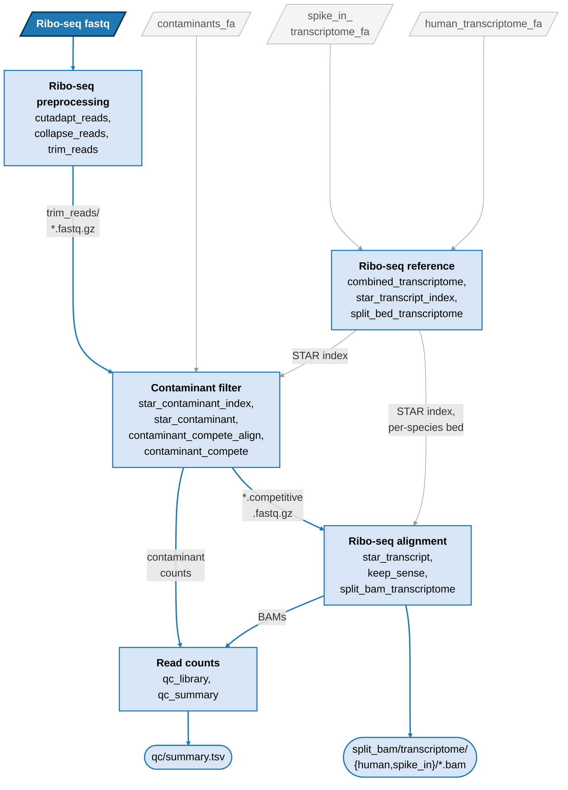

# wf-riboseq-align

A Snakemake workflow that takes raw Ribo-seq fastq files to **transcriptome-aligned BAM files**, split into the human
reads and the spike-in reads. It is a generalised, reproducible port of an existing lab Ribo-seq alignment pipeline.
It can be run on its own or imported into another Snakemake workflow. The original pipeline also quantified the
matched RNA-seq and mapped the Ribo-seq only to the transcripts expressed there. Here the Ribo-seq maps to the whole
transcriptome, so the alignment does not depend on the RNA-seq; the RNA-seq quantification and the expression filter
(applied when counting) are in wf-eIF-deltaTE.

## What it does



The bold input is the fastqs in `samples.csv`, the grey ones the references in `config.yaml`; square boxes are groups
of rules, rounded boxes the main outputs (see Outputs). Not shown: FastQC and MultiQC, which report on the fastqs
and every step's log.

Ribo-seq (single-end, with 4+4 nt randomers around the insert):

1. `cutadapt_reads`: trim the 3' adapter, keeping reads whose insert (the read without its randomers) is 18–100 nt
   (`minlength`, `maxlength`)
2. `collapse_reads`: collapse identical reads. The randomers are still part of the read at this point, so PCR
   duplicates collapse but distinct molecules stay distinct
3. `trim_reads`: strip the randomers and append them to the read name
4. `star_contaminant`: discard reads that map to rRNA / tRNA / other contaminants. `contaminant_compete_align` +
   `contaminant_compete` then put back every discarded read whose best sense alignment to the transcriptome (step 5's
   index and parameters) scores higher (STAR AS) than its contaminant alignment. A tie stays discarded (see
   Differences below)
5. `star_transcript`: map to the human + spike-in transcriptome (multimappers kept, up to 255 loci)
6. `keep_sense`: drop the antisense alignments. The libraries are stranded, so a footprint aligns to its transcript
   in sense, and STAR cannot be told to align to one strand only. A read with only antisense alignments is dropped;
   for the others, NH, MAPQ and the primary flag are set again from their sense alignments
7. `split_bam_transcriptome`: split into `human/` and `spike_in/` BAM files, sorted and indexed. A read aligned to
   both species is in neither file, as it may come from either: counted as human, a spike-in read would grow with
   the spike-in fraction, and counted as spike-in, a human one would distort the spike-in normalisation. The kept
   reads' records are STAR's (after `keep_sense`)
8. `qc_library`, `qc_summary`: per-library read counts: contaminant step (input, removed as unique hits, removed as
   multi-copy hits, put back by the competitive filter, clean) and species split (human only, spike-in only, both,
   spike-in fraction = spike-in-only /
   all mapped). Reads aligned to both species are in neither BAM file and are only counted. The run fails if any
   library's spike-in fraction is below `min_spike_in_fraction` (default 0.01; set 0 for libraries without spike-in)

FastQC (`fastqc_ribo_raw`, `fastqc_ribo_trimmed`): reports on the raw Ribo-seq fastqs and the trimmed reads that
`star_contaminant` maps (the output of step 3). Those trimmed reads are already collapsed, so their duplication plot
says nothing about PCR duplicates.

## Inputs

`config/samples.csv`, one row per library:

| column | |
|---|---|
| `sample_id` | free label, used in output names. It also becomes the read-name prefix of the reads |
| `read_type` | `ribo`. `rna` rows (paired-end RNA-seq) are checked, then skipped, so a workflow that imports this one can pass the same `samples.csv` |
| `fastq_1` | fastq.gz (R1 for `rna` rows) |
| `fastq_2` | R2 fastq.gz for `rna` rows; empty or no column for `ribo` |
| `experiment` | optional: run several experiments at once (see Outputs). `sample_id` must be unique across them |

`config/config.yaml` contains the cutadapt parameters, the contaminant fasta, the human and the spike-in
transcriptome fasta, and `min_spike_in_fraction`. Every key is commented in the file. The contaminant fasta defaults
to the set this repo ships, [resources/contaminants_built.fa](resources/contaminants_built.fa). Fill in the placeholder paths with your own data and references
before running. The workflow checks both files against [workflow/schemas/](workflow/schemas/) when it starts, so a
misspelt config key is an error.

## Outputs (under `RESULTS_DIR`, default `results/`)

```
split_bam/transcriptome/human/<sample>.bam(.bai)     Ribo-seq, human transcripts
split_bam/transcriptome/spike_in/<sample>.bam(.bai)  Ribo-seq, spike-in reads
qc/<sample>.stats.tsv, qc/summary.tsv                Ribo-seq read counts per library (collapsed reads)
fastqc/{ribo_raw,ribo_trimmed}/<sample>_fastqc.{html,zip}   FastQC, Ribo-seq before and after trimming
multiqc/multiqc_report.html                          MultiQC: cutadapt, each STAR step, FastQC
reference/                                           the references these were aligned to
  transcriptome.combined_human_spike_in.fa           (the BAM @SQ lines refer to this)
star/, filter_reads/, ...                            intermediates, incl. STAR Log.final.out
```

Per-step logs are written to `LOG_DIR` (default `logs/`). `logs/collapse_reads/` holds read counts, read-length
distributions and base composition.

With an `experiment` column (as in the example `config/samples.csv`), each experiment gets the above to itself, in
`RESULTS_DIR/<experiment>/` and `LOG_DIR/<experiment>/`, incl. its own `qc/summary.tsv` and MultiQC report. What does
not depend on the experiment (the references and both STAR indexes: contaminants and transcriptome) is built once, in
`RESULTS_DIR/reference/` and `RESULTS_DIR/star_index/`, so no experiment can be named `reference`, `star_index` or
`star`. Without the column, the whole of `samples.csv` is one experiment, directly in `RESULTS_DIR`.

## Setup

1. **Conda or mamba**, with the `bioconda` and `conda-forge` channels reachable. Used both to create the env below
   and, via `use-conda: true` in the profiles, to auto-build one isolated env per rule from `workflow/envs/*.yaml`
   on first run.
2. **A `snake` env** with Snakemake and pandas (`workflow/rules/common.smk` itself does `import pandas`, outside any
   per-rule env):
   ```bash
   mamba create -n snake -c conda-forge -c bioconda "snakemake=9.11" pandas
   ```
   Running on SLURM also needs the executor plugin in the same env:
   ```bash
   mamba install -n snake -c conda-forge -c bioconda snakemake-executor-plugin-slurm
   ```
3. **`config/config.yaml` and `config/samples.csv`** — fill in your own paths (see Inputs above).
4. **The execution profile you'll use**:
   - Local (`workflow/profiles/default/config.yaml`): adjust `cores` to your machine.
   - SLURM (`workflow/profiles/slurm/config.yaml`): set `slurm_account` and `slurm_partition` to your cluster's
     values. The shipped defaults are placeholders and will fail on any other cluster.

## Run it

```bash
./snakemake.sh -n          # dry run: always do this first
./snakemake.sh             # local (workflow/profiles/default)
sbatch slurm_job.sh        # SLURM: one job per rule (workflow/profiles/slurm)
```

Both wrappers activate the `snake` conda env. To use your own config: `./snakemake.sh --configfile my_config.yaml`.

## Test data

`.test/` holds a tiny synthetic dataset: random sequences written by `.test/make_data.py`, not real reads. It is
built so that every step has something to do: PCR duplicates, adapter dimers, contaminant reads, reads on two
contaminants, reads that tie with or beat their contaminant alignment, reads aligned to both species, antisense reads,
two experiments, and `rna` rows (skipped). The whole workflow runs on it in a few minutes:

```bash
snakemake -s workflow/Snakefile --directory .test --use-conda --cores 2
```

CI ([.github/workflows/test.yaml](.github/workflows/test.yaml)) runs lint, a dry run and this run on every push to
`main` and on pull requests, and fails if `qc/summary.tsv` has no multi-contaminant or both-species reads, or if
`keep_sense` dropped no antisense-only read or moved no primary.

## Use it from another workflow

Import it as a Snakemake module and give it its own config block:

```python
# Snakefile of the importing workflow
configfile: "config/config.yaml"      # contains an `align:` block shaped like this repo's config.yaml

module align:
    snakefile: "/path/to/wf-riboseq-align/workflow/Snakefile"
    config: config["align"]

use rule * from align as align_*
```

For several experiments, import it once with an `experiment` column in its `samples.csv` (with `RESULTS_DIR:
results/align`, experiment `treatmentA` lands in `results/align/treatmentA/`), rather than once per experiment.
Relative paths in the `align` block are resolved from the importing workflow's directory. Its rules can then
consume, for example, `rules.align_split_bam_transcriptome.output.bam`.

## Reproducibility

- Every rule has a conda env with exact version pins. STAR 2.7.10b and samtools 1.17 are the versions in the original
  pipeline's container.
- cutadapt is 5.2 on Python 3.13, because no cutadapt build exists for Python 3.14 yet. On a 2M-read test library
  its output is byte-identical to 4.4, the container's version, which in turn reproduces the original pipeline's
  trimmed reads exactly.
- The helper scripts are Python (3.14) ports of the original pipeline's Perl and R scripts. Each was checked against
  the original, or against the original pipeline's saved output, on real data. All gave identical output: the
  collapse statistics (41.1M → 12.4M reads), the collapsed reads themselves, and the randomer trimming.